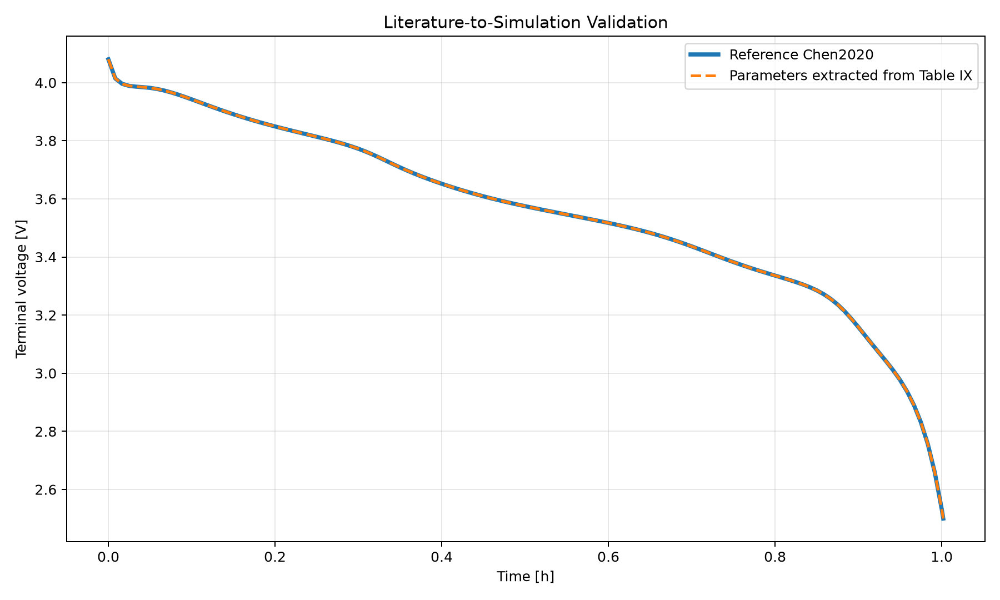
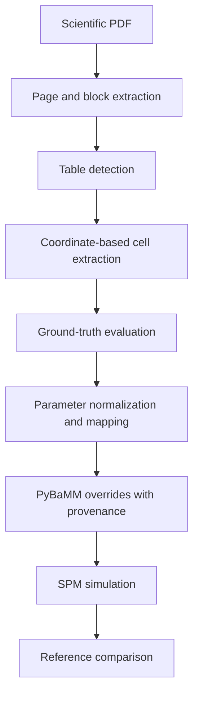

# Literature-to-Simulation Bridge

A traceable pipeline that extracts battery-model parameters from scientific literature, maps them to PyBaMM parameter names, and uses them to run a reproducible lithium-ion battery simulation.

> **Status:** Research and portfolio prototype validated on one scientific article and two parameter tables. Generalisation to additional papers remains future work.



## Overview

Battery modelling papers often report important parameters inside complex PDF tables. Reusing these values in a simulator normally requires manual reading, transcription, unit interpretation, parameter-name mapping, and validation.

This project implements a first automated and traceable bridge between scientific literature and battery simulation:

1. Parse a scientific PDF with page-level provenance.
2. Detect candidate parameter tables;
3. extract table cells using document coordinates and detected headers;
4. normalize scientific notation and numerical values;
5. map literature terminology to PyBaMM parameter names;
6. retain provenance for every generated override;
7. run a PyBaMM Single Particle Model;
8. compare the generated simulation against a controlled reference.

The current case study uses the parameterisation published by Chen et al. for a commercial LG M50 lithium-ion cell.

## Scientific source

- Chen, C.-H. et al. (2020), *Development of Experimental Techniques for Parameterization of Multi-scale Lithium-ion Battery Models*, Journal of The Electrochemical Society, 167, 080534.
- DOI: [10.1149/1945-7111/ab9050](https://doi.org/10.1149/1945-7111/ab9050)
- PyBaMM parameter set: `Chen2020`

The source PDF is not distributed in this repository. Its expected local location and metadata are documented in [`data/raw/papers/README.md`](data/raw/papers/README.md) and [`source_manifest.json`](data/raw/papers/source_manifest.json).

## Pipeline



## Current results

### Table extraction

| Source table | Extracted rows | Evaluated numeric values | Precision | Recall | F1 |
|---|---:|---:|---:|---:|---:|
| Table VII | 21 | 33 | 1.0000 | 1.0000 | 1.0000 |
| Table IX | 6 | 24 | 1.0000 | 1.0000 | 1.0000 |

These scores apply only to the two evaluated tables from the Chen2020 article. They must not be interpreted as performance on arbitrary scientific PDFs.

### Comparison with PyBaMM

Table VII contains experimental parameter values, while Table IX reports parameters tuned for the simulations presented in the article.

The Table VII comparison produced:

| Comparison status | Records |
|---|---:|
| Exact match | 18 |
| Expected tuned difference | 7 |
| Not directly comparable | 8 |

The Table IX comparison produced:

| Comparison status | Records |
|---|---:|
| Exact match with the current `Chen2020` set | 7 |
| Requires indirect initial-condition handling | 1 |

Seven directly usable PyBaMM overrides were generated from Table IX. The reported positive-electrode 100% SOC stoichiometry was retained in provenance but excluded from direct scalar overrides because it requires initial-condition conversion.

### End-to-end simulation validation

The extracted and mapped parameters were used in a PyBaMM Single Particle Model with the following controlled protocol:

- parameter base: `Chen2020`;
- discharge: `1C`;
- voltage cut-off: `2.5 V`;
- initial state of charge: `100%`;
- output period: `30 seconds`.

| Metric | Result |
|---|---:|
| Reference points | 122 |
| Literature-derived simulation points | 122 |
| Same time grid | Yes |
| Voltage RMSE | `2.1275e-16 V` |
| Maximum absolute voltage error | `4.4409e-16 V` |
| Final capacity difference | `0 Ah` |
| Duration difference | `0 s` |
| Validation | Passed |

The remaining voltage differences are at floating-point precision level.

This result demonstrates that the extraction-to-simulation pipeline can reproduce the controlled Chen2020 reference when the extracted values, model, protocol, initial state, and sampling configuration are identical. It does not yet demonstrate generalisation to unseen articles.

## Repository structure

```text
literature-to-simulation-bridge/
 data/
    ground_truth/     # Visually verified Table VII and IX records
    interim/          # Page, block and table-detection outputs
    processed/        # Extracted rows and PyBaMM overrides
    raw/              # Local source-paper instructions and manifest
    reference/        # Exported PyBaMM Chen2020 registry
 notebooks/            # Initial environment and parsing notebook
 results/
    data/             # Simulation time series and summaries
    evaluation/       # Extraction and simulation metrics
    figures/          # Voltage comparison figures
 src/
    evaluation/       # Table extraction evaluation
    extraction/       # Coordinate and header-based extraction
    ground_truth/     # Ground-truth dataset construction
    parameters/       # PyBaMM registry and override construction
    parsing/          # PDF parsing and table detection
    simulation/       # Reference and literature-derived simulations
    utils/
 README.md
 requirements.txt
```

## Installation

The current prototype was tested on Windows with Python 3.14.3 and PyBaMM 26.8.0.0.

```powershell
git clone https://github.com/Hassna-elbousiydy/literature-to-simulation-bridge.git
Set-Location "literature-to-simulation-bridge"

python -m venv .venv
$VenvPython = Join-Path (Get-Location).Path ".venv\Scripts\python.exe"

& $VenvPython -m pip install --upgrade pip
& $VenvPython -m pip install -r requirements.txt
```

Place the legally obtained Chen2020 PDF at:

```text
data/raw/papers/chen2020_parameterization.pdf
```

## Reproducing the pipeline

Run the commands from the repository root.

### 1. Build the reference simulation and parameter registry

```powershell
& $VenvPython "src\simulation\pybamm_runner.py"
& $VenvPython "src\parameters\export_pybamm_reference.py"
```

### 2. Parse the paper and detect tables

```powershell
& $VenvPython "src\parsing\pdf_extraction.py"
& $VenvPython "src\parsing\table_extraction.py"
```

### 3. Extract Tables VII and IX

```powershell
& $VenvPython "src\extraction\table_vii_coordinate_extractor.py"
& $VenvPython "src\extraction\table_ix_header_extractor.py"
```

### 4. Evaluate automatic extraction

```powershell
& $VenvPython "src\evaluation\evaluate_table_vii_extraction.py"
& $VenvPython "src\evaluation\evaluate_table_ix_extraction.py"
```

### 5. Generate PyBaMM overrides

```powershell
& $VenvPython `
    "src\parameters\build_simulation_parameters_from_extraction.py"
```

### 6. Run and validate the literature-derived simulation

```powershell
& $VenvPython "src\simulation\run_from_literature.py"
```

A successful run ends with:

```text
Same time grid: True
Validation passed: True
```

## Traceability

The project retains intermediate evidence instead of producing only a final simulation:

- PDF page and block provenance;
- detected table locations;
- raw extracted cell text;
- normalized numerical values;
- manually verified ground truth;
- literature-to-PyBaMM name mappings;
- excluded or indirectly mapped records;
- generated overrides;
- simulation configuration;
- evaluation thresholds and metrics.

The provenance associated with the seven generated overrides is available in:

[`data/processed/chen2020/pybamm_overrides_from_table_ix_provenance.json`](data/processed/chen2020/pybamm_overrides_from_table_ix_provenance.json)

## Limitations

- The extraction pipeline has currently been evaluated on only two tables from one article.
- Table VII and Table IX use different layouts, but this is not sufficient to establish cross-document generalisation.
- Ground-truth records were manually verified.
- Some scientific parameters require semantic or physical conversions rather than direct scalar mapping.
- The current extractors still contain table-specific assumptions.
- The source PDF must be obtained separately and is intentionally excluded from Git.
- The dependency versions are not yet fully pinned.
- Automated unit conversion and uncertainty propagation are not yet implemented.

## Roadmap

- [x] Reproducible Chen2020 reference simulation
- [x] Page- and block-level PDF extraction
- [x] Table detection baseline
- [x] Table VII coordinate extraction and evaluation
- [x] Table IX header-anchored extraction and evaluation
- [x] Literature-to-PyBaMM parameter mapping
- [x] Provenance-aware override generation
- [x] End-to-end simulation validation
- [ ] Add automated tests and continuous integration
- [ ] Pin a reproducible Python environment
- [ ] Add automatic unit normalization
- [ ] Evaluate an unseen article with a different table layout
- [ ] Generalize table-boundary and column detection
- [ ] Propagate parameter uncertainty into simulations
- [ ] Compare simulated curves with experimental measurements

## Technologies

- Python
- PyMuPDF
- pandas
- NumPy
- Matplotlib
- PyBaMM
- JSON and CSV provenance artifacts
- Git and GitHub

## References

- [Chen et al. (2020)](https://doi.org/10.1149/1945-7111/ab9050)
- [PyBaMM documentation](https://docs.pybamm.org/)
- [PyBaMM parameter sets](https://docs.pybamm.org/en/stable/source/api/parameters/parameter_sets.html)
- [PyMuPDF text extraction documentation](https://pymupdf.readthedocs.io/en/latest/app1.html)

## Author

**Hassna El-Bousiydy**

Data Scientist and NLP/ML Engineer working on scientific information extraction, literature mining, and battery modelling.

GitHub: [Hassna-elbousiydy](https://github.com/Hassna-elbousiydy)
